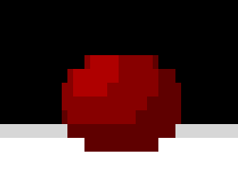
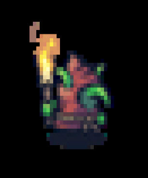
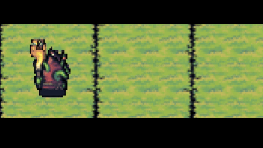

# TerminalCanvas

Draw something on your terminal



## How to use:

1. install package or download repo as you need:

   ```python
   pip install baeshade
   ```
2. View examples folder learn more usage examples
3. Ctrl + C to quit

## Learn from examples

examples/Draw2dExample.py


examples/BitmapExample.py



examples/SpriteExample.py



## Basic usage:

### class BaeApp

A simple wrapper for run a terminal canvas instance.

### class BaeRenderingTask

An utility class you need to inherit, it has a DPI(Draw Pipeline Interface) for providing various drawing methods:

##### def drawStyleText(x:int, y:int, txt:str, fontColor=ColorPallette4bit.white, bgColor= ColorPallette4bit.black_bg, style:BaeFontStyle = 0, bNeedRestStyle:bool = False)
  
  - used for drawing text on canvas

##### def drawLine2D(self, start:BaeVec2d, end:BaeVec2d, color:BaeVec3d)
  
  - used for drawing line on canvas

##### def drawSolidCircle2D(self, center:BaeVec2d, r:float, color:BaeVec3d)
  
  - used for drawing circle on canvas

##### def drawPixel(self,x:int,y:int,color:BaeVec3d)
  
  - the most basic method, you can use is to draw various patterns

##### def runShader(self, shader:Callable[[int,int,dict],BaeVec3d])
  
  - Another version of drawPixel is conceptually equivalent to a shader (or kernel) running on a GPU. Note: It still runs on the CPU in the Python interpreter.

## Citation

1. The goblin and ground resource I used for demo are obtained from https://pixelfrog-assets.itch.io/tiny-swords
2. The demonstration code in the shader example is ported from shadertoy. The original author can see the comments in the example code

If you like it, welcome to support it 💖.
